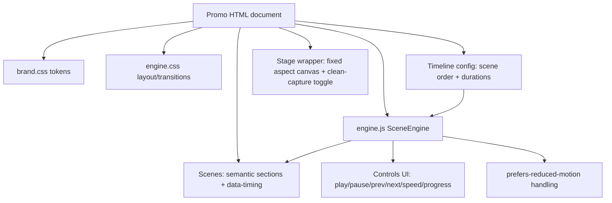
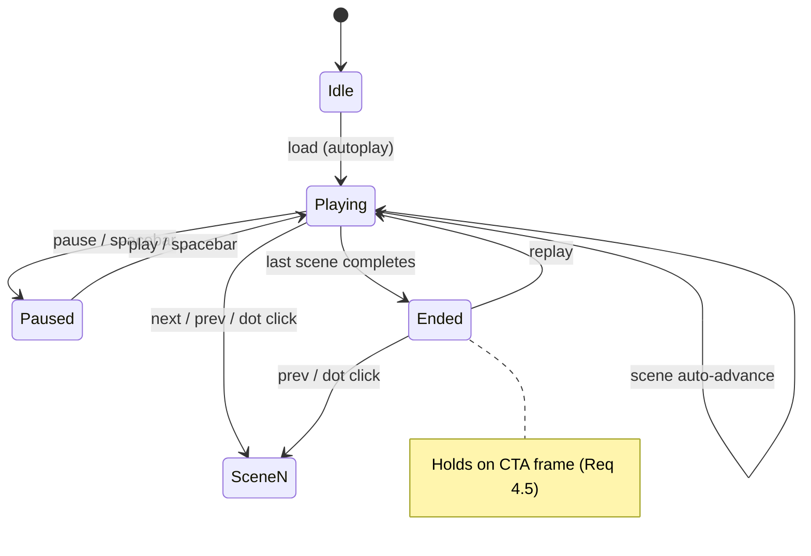

# Design Document

## Overview

This design defines a small, reusable system for building KloudBean's animated promotional explainers as **standalone HTML files** that run with zero build step. The system has three layers:

1. **Brand + Engine core** — shared CSS brand tokens and a JavaScript "scene engine" that sequences timed scenes, drives playback controls, and respects accessibility settings.
2. **Promo documents** — individual HTML files, each declaring its scenes (markup) and a timeline (config). Each promo embeds the engine inline so it remains a single portable file.
3. **Distribution wrappers** — per-aspect-ratio canvas sizing (16:9, 1:1, 9:16) and a "clean capture" mode for screen recording.

The first releases are: a **flagship agency lead-gen explainer** (60–90s) and **short-form social cuts** (15–30s) in the three aspect ratios.

Because the production KloudBean repo lives outside this workspace sandbox, all assets are authored under `.kiro/specs/kloudbean-agency-promos/assets/` and are designed to be copied into the real repo unchanged.

### Goals

- Single-file, zero-build, offline-capable promos (Req 6).
- One reusable engine + brand token file, copy-pasted (inlined) into each promo (Req 4, 5).
- Factually grounded, agency-focused narrative with strong CTAs (Req 1, 2, 3).
- Recording-ready fixed canvases with a controls-hide mode (Req 7).
- Accessible: contrast, reduced-motion, no harmful flashing, text-first messaging (Req 8).

### Non-Goals

- No server-side rendering, no bundler, no npm dependency for playback.
- No automated MP4 export pipeline in v1 (capture is via screen recording; an optional Remotion/ffmpeg path is noted as future work).
- No CMS or dynamic data fetching; copy is static and embedded.

## Architecture

### High-Level Structure

```
.kiro/specs/kloudbean-agency-promos/assets/
├── README.md                  # what each promo is, duration, ratio, how to record
├── shared/
│   ├── brand.css              # brand tokens (colors, gradients, fonts, spacing)
│   ├── engine.css             # scene/stage/controls layout + transitions
│   └── engine.js              # SceneEngine controller (timeline, playback, a11y)
├── promos/
│   ├── flagship-agency-16x9.html      # 60–90s flagship (landscape)
│   ├── social-leadgen-9x16.html       # 15–30s vertical cut
│   ├── social-leadgen-1x1.html        # 15–30s square cut
│   └── social-leadgen-16x9.html       # 15–30s landscape cut
└── build/
    └── inline.mjs             # optional: inlines shared/* into a promo for true single-file export
```

Authoring uses the shared files via relative `<link>`/`<script>` for fast iteration. For final delivery, `build/inline.mjs` produces a fully self-contained HTML (inlined CSS/JS) per Requirement 6.1. During development the linked version still satisfies offline playback (Req 6.2) since all assets are local.

### Component Diagram



### Playback State Machine



## Components and Interfaces

### 1. Brand Tokens (`shared/brand.css`)

A single source of truth for the visual system (Req 5.1, 5.2). All values are CSS custom properties on `:root`. Colors are a **documented placeholder palette** clearly marked for replacement once official brand assets are provided.

```css
:root {
  /* ===== PLACEHOLDER BRAND PALETTE — replace with official KloudBean tokens ===== */
  --kb-bg-0: #0a0f1e;          /* deep night background */
  --kb-bg-1: #0e1730;          /* panel background */
  --kb-ink: #eaf0ff;           /* primary text on dark */
  --kb-ink-dim: #9fb0d0;       /* secondary text */
  --kb-brand: #2f6bff;         /* primary brand blue */
  --kb-brand-2: #38d6c9;       /* accent teal */
  --kb-accent: #ffb020;        /* highlight / money/commission accent */
  --kb-danger: #ff5d6c;        /* "pain"/problem state */
  --kb-ok: #41d18b;            /* success / "with KloudBean" */
  --kb-grad-hero: linear-gradient(135deg, var(--kb-brand), var(--kb-brand-2));
  --kb-grad-money: linear-gradient(135deg, var(--kb-accent), #ff7a59);

  /* Typography */
  --kb-font-display: "Inter", system-ui, -apple-system, "Segoe UI", sans-serif;
  --kb-font-body: "Inter", system-ui, -apple-system, "Segoe UI", sans-serif;
  --kb-fs-display: clamp(40px, 6vw, 88px);
  --kb-fs-subhead: clamp(20px, 2.4vw, 34px);
  --kb-fs-body: clamp(15px, 1.4vw, 22px);
  --kb-fs-micro: clamp(11px, 1vw, 14px);

  /* Spacing / radius / shadow */
  --kb-space: clamp(12px, 2vw, 28px);
  --kb-radius: 18px;
  --kb-shadow: 0 20px 60px rgba(0,0,0,.45);
}
```

Font strategy: default to a system font stack so promos play offline (Req 6.2). Optionally a self-hosted "Inter" can be embedded later; we will not require a remote font CDN for core playback.

### 2. Engine Layout + Transitions (`shared/engine.css`)

Responsibilities:
- **Stage**: a fixed-aspect canvas centered in the viewport (Req 7.1, 7.2). Aspect controlled by a body class (`ratio-16x9`, `ratio-1x1`, `ratio-9x16`).
- **Scenes**: absolutely stacked; only the active scene is visible. Transitions use only `transform` and `opacity` for 60fps (Req 4.6).
- **Controls**: a bottom control bar (play/pause, prev/next, speed, progress, scene counter). Hidden in clean-capture mode (Req 7.3).
- **Reduced motion**: under `@media (prefers-reduced-motion: reduce)`, long/animated transitions collapse to short cross-fades (Req 8.3).

Canvas sizing approach: the stage is laid out at a logical design size per ratio and scaled to fit the viewport with a CSS `transform: scale()` (computed by the engine), so text/layout are authored at a fixed pixel grid (e.g., 1920×1080) and the recording always matches that grid.

```css
.kb-stage { position: relative; overflow: hidden; background: var(--kb-bg-0); }
.ratio-16x9 .kb-stage { width: 1920px; height: 1080px; }
.ratio-1x1  .kb-stage { width: 1080px; height: 1080px; }
.ratio-9x16 .kb-stage { width: 1080px; height: 1920px; }

.kb-scene {
  position: absolute; inset: 0; opacity: 0;
  transform: translateY(24px) scale(.992);
  transition: opacity var(--t, .6s) ease, transform var(--t, .6s) ease;
  will-change: opacity, transform; pointer-events: none;
}
.kb-scene.is-active { opacity: 1; transform: none; pointer-events: auto; }

body.clean .kb-controls { opacity: 0; pointer-events: none; }

@media (prefers-reduced-motion: reduce) {
  .kb-scene { transition: opacity .2s linear; transform: none; }
  [data-anim] { animation: none !important; }
}
```

### 3. Scene Engine (`shared/engine.js`)

A small dependency-free controller. Public interface:

```js
/**
 * @typedef {Object} SceneSpec
 * @property {string} id           // matches a [data-scene="id"] element
 * @property {number} duration     // seconds at 1x before auto-advance
 * @property {string} [label]      // shown in the counter/tooltip
 */

/**
 * @typedef {Object} EngineOptions
 * @property {SceneSpec[]} timeline  // ordered scenes + durations (Req 7.4)
 * @property {boolean} [autoplay=true]
 * @property {number}  [speed=1]     // 0.5 | 1 | 1.5 | 2 (Req 4.3)
 * @property {boolean} [holdOnEnd=true] // stay on CTA frame (Req 4.5)
 */

class SceneEngine {
  constructor(rootEl, options) {}
  play() {}                 // start/resume auto-advance (Req 4.1)
  pause() {}                // halt timer (Req 4.2)
  toggle() {}               // play/pause (spacebar)
  next() {}                 // advance one scene (Req 4.2)
  prev() {}                 // go back one scene (Req 4.2)
  goTo(index) {}            // jump to scene by index (dot click)
  setSpeed(multiplier) {}   // re-scale all durations (Req 4.3)
  replay() {}               // from Ended -> scene 0 (Req 4.5)
  get state() {}            // 'idle'|'playing'|'paused'|'ended'
  // emits progress to update counter "n / total" + time bar (Req 4.4)
}
```

Engine behavior details:
- **Timer model**: each scene uses a single `setTimeout(duration / speed)` to schedule the next advance; a progress `requestAnimationFrame` loop drives the time bar. Using transform/opacity keeps it at 60fps (Req 4.6).
- **Speed change** recomputes the remaining time for the current scene proportionally so changing speed mid-scene is smooth (Req 4.3).
- **Keyboard**: Space = toggle, ←/→ = prev/next, `c` = toggle clean-capture mode (Req 7.3).
- **Hold on end**: when the last scene's timer fires, the engine enters `ended` and does not loop; replay is available (Req 4.5).
- **Reduced motion**: if `matchMedia('(prefers-reduced-motion: reduce)')` matches, the engine adds a class so CSS simplifies transitions and disables decorative keyframe animations (Req 8.3).

### 4. Controls UI

Rendered by the engine into a `.kb-controls` bar:
- Prev (◀), Play/Pause (⏸/▶), Next (▶▶)
- Speed selector: 0.5× / 1× / 1.5× / 2× (Req 4.3)
- Scene counter "n / total" + current scene label (Req 4.4)
- Progress bar reflecting elapsed time of current scene (Req 4.4)
- These mirror the v27 reference control affordances.

### 5. Stage Wrapper + Capture Mode

- The `<body>` gets a `ratio-*` class selecting canvas dimensions (Req 7.1).
- The engine computes `scale = min(vw / stageW, vh / stageH)` and applies it to the stage so the fixed-grid canvas always fits and centers (Req 7.2).
- `c` key (and an optional on-screen toggle) sets `body.clean` to hide controls for unobstructed capture (Req 7.3).

## Content Design (Scene Scripts)

All copy below is grounded in the Research Source Material (Req 1). Numbers are presented exactly as sourced.

### Flagship Agency Lead-Gen Explainer (`flagship-agency-16x9.html`, ~75s, 16:9)

| # | Scene id | ~dur | On-screen message | Visual motif |
|---|----------|------|-------------------|--------------|
| 1 | hook | 6s | "Run an agency? Your clients' sites shouldn't run your life." | Logo + cloud particles, hero gradient |
| 2 | pain | 9s | Agency pain: juggling client servers, manual SSL, midnight incidents, 5 consoles | Tangled dashboards, red accents (--kb-danger) |
| 3 | solution | 9s | "One managed platform for every client app." Deploy → DB → SSL → monitor | Unified console mock, calm blue |
| 4 | providers | 7s | "Any cloud. Fully managed." AWS · GCP · DigitalOcean · Linode · Vultr · Lightsail · UpCloud | 7 provider chips animate in |
| 5 | stacks | 7s | "Every stack you ship." WordPress, Laravel, Next.js, Node, Django, React, n8n (+15 more) | Stack tiles cascade |
| 6 | agency-value | 10s | Client portfolio in one dashboard · free zero-downtime migrations · 24/7 human support · predictable resellable pricing | Split benefit cards (--kb-ok) |
| 7 | commission | 12s | "Earn 10% monthly recurring commission — for life." Example: $1,000/mo client → $100/mo → $3,600 over 3 yrs. No caps. | Animated counter ticking up (--kb-grad-money) |
| 8 | trust | 7s | "1,000+ businesses · 30+ countries · 2-min avg human support · 30-day money-back." | Trust stat badges |
| 9 | cta | 8s+hold | "Start free. Or become a partner." Start Free Trial → console.kloudbean.com · Join Partner Program | Logo lockup, CTA buttons, holds |

### Short-Form Lead-Gen Cut (`social-leadgen-*.html`, ~22s)

Same content distilled, hook-first within 3s (Req 3.2), single CTA (Req 3.4), legible silent (Req 3.5).

| # | Scene id | ~dur | Message |
|---|----------|------|---------|
| 1 | hook | 4s | "Hosting client sites is eating your week." |
| 2 | turn | 5s | "KloudBean manages it all — deploys, SSL, DBs, monitoring." |
| 3 | money | 7s | "And pays you 10% recurring commission. For life." (counter) |
| 4 | cta | 6s+hold | "Start free → kloudbean.com" |

Layout adapts per ratio variant; copy and timeline are shared, only the stage class and a few layout utility classes differ.

## Data Models

### Timeline Config (per promo, inline)

```js
const TIMELINE = [
  { id: 'hook',         duration: 6,  label: 'Intro' },
  { id: 'pain',         duration: 9,  label: 'The problem' },
  { id: 'solution',     duration: 9,  label: 'One platform' },
  { id: 'providers',    duration: 7,  label: 'Any cloud' },
  { id: 'stacks',       duration: 7,  label: 'Every stack' },
  { id: 'agency-value', duration: 10, label: 'For agencies' },
  { id: 'commission',   duration: 12, label: 'Earn for life' },
  { id: 'trust',        duration: 7,  label: 'Trusted' },
  { id: 'cta',          duration: 8,  label: 'Start free' },
];
```

This single array is the only place scene timing lives (Req 7.4); reordering or re-timing requires no animation rewrites.

### Brand Token Map (conceptual)

| Token group | Keys | Purpose |
|-------------|------|---------|
| Background | `--kb-bg-0/1` | Stage + panels |
| Text | `--kb-ink`, `--kb-ink-dim` | Hierarchy |
| Brand | `--kb-brand`, `--kb-brand-2` | Identity, gradients |
| Semantic | `--kb-danger`, `--kb-ok`, `--kb-accent` | Pain/solution/money states |
| Type | `--kb-fs-*`, `--kb-font-*` | Typography scale |

## Error Handling

Since promos are static and offline, "errors" are mostly authoring/runtime robustness:

- **Missing scene element**: if a `timeline` id has no matching `[data-scene]`, the engine logs a console warning and skips it rather than stalling the sequence.
- **Empty timeline**: engine renders the first available `[data-scene]` statically and disables auto-advance.
- **Reduced-motion**: engine downgrades animations gracefully (no breakage).
- **Viewport too small**: scale-to-fit guarantees the canvas remains fully visible (letterboxed), never clipped.
- **Speed bounds**: `setSpeed` clamps to the allowed set {0.5,1,1.5,2}; invalid values fall back to 1×.
- **Inline build failure**: `build/inline.mjs` validates that referenced shared files exist before writing the single-file output; on failure it exits non-zero with a clear message and leaves the linked authoring version intact.

## Testing Strategy

Manual + lightweight automated checks (no heavy test infra, consistent with zero-build delivery):

1. **Playback functional check (manual)**: load each promo; verify autoplay, pause/resume, prev/next, speed 0.5–2×, counter + progress accuracy, hold-on-end, and replay (Req 4).
2. **Aspect/recording check (manual)**: load each ratio variant; confirm fixed canvas, centered scaling, and that `c` hides controls for clean capture (Req 7).
3. **Accessibility checks**:
   - Contrast: verify body text meets 4.5:1 against backgrounds using a contrast tool (Req 8.1).
   - Reduced motion: toggle OS setting and confirm animations simplify (Req 8.3).
   - Flash audit: visual review that no scene flashes >3×/sec (Req 8.2).
4. **Fact audit (manual checklist)**: a reviewer cross-checks every numeric/feature claim in each promo against the Research Source Material table (Req 1). Documented as a checklist in the assets README.
5. **Offline check**: open via `file://` with network disabled; confirm full playback (Req 6.2, 6.3).
6. **Single-file export check**: run `build/inline.mjs`, open the produced file standalone, confirm identical playback (Req 6.1).
7. **Smoke automation (optional)**: a tiny Node script can assert each promo HTML contains a `TIMELINE`, a matching `[data-scene]` per id, and a CTA URL string — guarding against drift. Runs with `node` only, no install.

## Implementation Notes / Future Work

- **MP4 export**: v1 relies on screen recording. A future task can add a Remotion or Puppeteer+ffmpeg path that drives the same `TIMELINE` to render frames deterministically.
- **Brand swap**: once official hex values, logo SVG, and licensed fonts are provided, only `brand.css` (and an embedded logo) change; promos inherit automatically (Req 5.1).
- **Localization**: copy is centralized per scene; a future variant could externalize strings for multi-language cuts.
- **A/B hooks**: because hooks live in the first scene only, alternate hook scenes can be swapped to test messaging without touching the rest.

## Correctness Properties

These are invariants the implementation must uphold. They map directly to requirements and are checkable by the testing strategy above.

### Property 1: Single active scene

At any moment exactly one `[data-scene]` has `is-active` (except during the brief cross-fade where the outgoing scene is transitioning out). No two scenes are simultaneously interactive.

**Validates: Requirements 4.1, 4.6**

### Property 2: Timeline ↔ DOM consistency

Every `id` in `TIMELINE` resolves to exactly one `[data-scene]` element, and every advanced scene index stays within `[0, timeline.length - 1]`.

**Validates: Requirements 4.4**

### Property 3: Monotonic progress within a scene

The progress indicator increases monotonically from 0→1 across a scene at the current speed, and resets to 0 on scene change.

**Validates: Requirements 4.4**

### Property 4: Speed invariance of content

Changing speed alters only playback rate, never scene order, content, or which scene is active. Total real-time duration scales by `1/speed`.

**Validates: Requirements 4.3**

### Property 5: Hold-on-end

Once the final scene completes, the engine state is `ended`, no further auto-advance occurs, and the CTA frame remains visible until `replay()` or manual navigation.

**Validates: Requirements 4.5**

### Property 6: Capture cleanliness

In `body.clean` mode, no control affordance is visible or interactive, and the stage content/scaling is unchanged.

**Validates: Requirements 7.3**

### Property 7: Canvas fidelity

The stage always renders at its logical aspect dimensions and is fully contained (letterboxed if needed), never clipped, regardless of viewport size.

**Validates: Requirements 7.1, 7.2**

### Property 8: Reduced-motion safety

When `prefers-reduced-motion: reduce` is active, no decorative keyframe animation runs and scene changes use a short fade; the same textual message is still shown.

**Validates: Requirements 8.3, 8.4**

### Property 9: Flash safety

No scene produces more than 3 luminance flashes per second.

**Validates: Requirements 8.2**

### Property 10: Fact integrity

Every numeric/feature/offer claim rendered on screen has a corresponding entry in the Research Source Material.

**Validates: Requirements 1.1, 1.2, 1.3**

### Property 11: Offline determinism

Playback produces identical visuals and timing whether loaded over `http(s)://` or `file://`, with no network access.

**Validates: Requirements 6.2, 6.3**

### Property 12: Single-CTA terminality (short-form)

Each short-form cut ends on exactly one CTA with one destination URL.

**Validates: Requirements 3.4**
