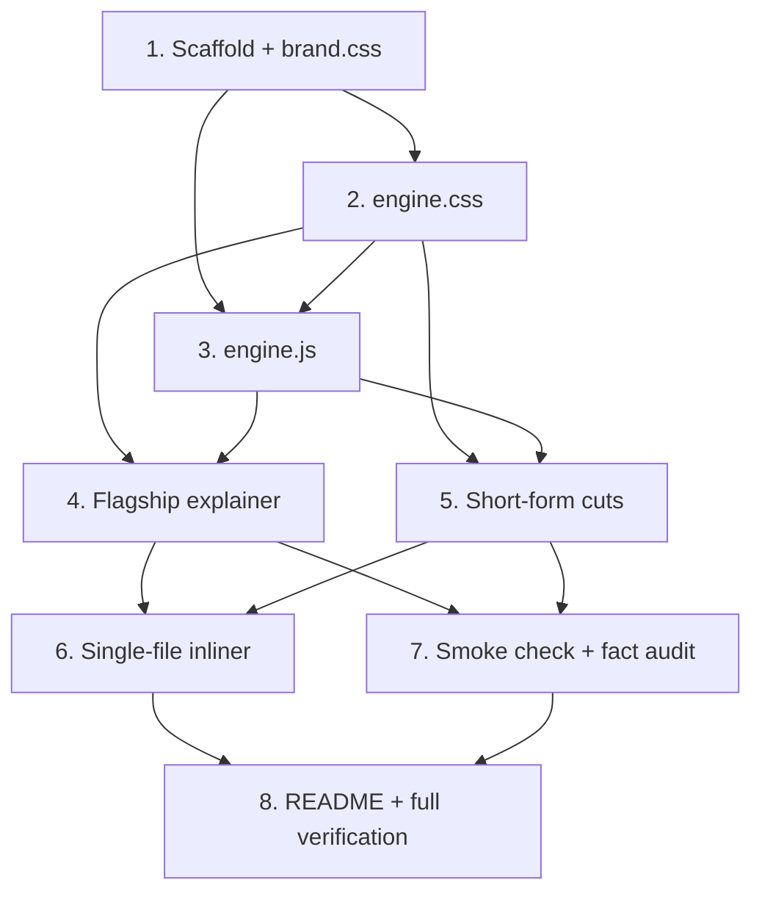

# Implementation Plan

## Overview

This plan builds a reusable, zero-build animation system and the first set of KloudBean promos. Work proceeds bottom-up: shared brand tokens and engine first (tasks 1–3), then the flagship agency explainer (task 4), then short-form social cuts in three aspect ratios (task 5), followed by optional tooling, QA scripts, and documentation (tasks 6–8). Every task is incremental and testable in a browser with no build step.

## Tasks

- [x] 1. Scaffold the assets workspace and shared brand tokens
  - Create `.kiro/specs/kloudbean-agency-promos/assets/` with `shared/`, `promos/`, and `build/` subfolders
  - Implement `shared/brand.css` with the full placeholder token set (backgrounds, ink, brand, semantic, gradients, typography scale, spacing/radius/shadow), clearly commented "PLACEHOLDER — replace with official KloudBean tokens"
  - Use a system font stack (no remote font CDN) so promos play offline
  - _Requirements: 5.1, 5.2, 5.3, 6.2_

- [x] 2. Build the engine stylesheet (`shared/engine.css`)
- [x] 2.1 Implement the fixed-aspect stage and scaling layout
  - Add `.kb-stage` plus `ratio-16x9` (1920×1080), `ratio-1x1` (1080×1080), `ratio-9x16` (1080×1920) sizing
  - Center the stage in the viewport; rely on a JS-set `transform: scale()` variable for fit-to-viewport letterboxing
  - _Requirements: 7.1, 7.2_
- [x] 2.2 Implement scene stacking and transform/opacity transitions
  - Absolutely-stacked `.kb-scene`, only `.is-active` visible/interactive, transitions limited to transform + opacity for 60fps
  - _Requirements: 4.1, 4.6_
- [x] 2.3 Implement controls bar styling and clean-capture mode
  - Style `.kb-controls` (prev/play-pause/next, speed group, counter, progress bar)
  - Add `body.clean` rule that hides/disables controls without changing stage layout
  - _Requirements: 4.2, 4.3, 4.4, 7.3_
- [x] 2.4 Add accessibility rules
  - `@media (prefers-reduced-motion: reduce)`: collapse scene transitions to a short fade and disable `[data-anim]` keyframes
  - Ensure text styles use tokens that meet 4.5:1 contrast on the defined backgrounds
  - _Requirements: 8.1, 8.3, 8.4_

- [x] 3. Implement the SceneEngine controller (`shared/engine.js`)
- [x] 3.1 Core sequencing and state machine
  - Implement `SceneEngine(rootEl, options)` with states `idle|playing|paused|ended`
  - Auto-advance via `setTimeout(duration / speed)`; `requestAnimationFrame` loop drives progress
  - Enforce single-active-scene invariant on every transition
  - _Requirements: 4.1, 4.6_
- [x] 3.2 Playback API and keyboard shortcuts
  - Implement `play/pause/toggle/next/prev/goTo/replay`
  - Bind Space = toggle, ←/→ = prev/next, `c` = toggle `body.clean`
  - _Requirements: 4.2, 7.3_
- [x] 3.3 Speed control with mid-scene rescale
  - Implement `setSpeed(m)` clamped to {0.5, 1, 1.5, 2}; recompute remaining time proportionally; invalid → 1×
  - _Requirements: 4.3_
- [x] 3.4 Progress reporting and scene counter
  - Update progress bar (monotonic 0→1, reset on change) and "n / total" + scene label
  - _Requirements: 4.4_
- [x] 3.5 Hold-on-end and replay
  - On final scene completion enter `ended`, stop auto-advance, keep CTA visible; `replay()` restarts from scene 0
  - _Requirements: 4.5_
- [x] 3.6 Robustness and reduced-motion wiring
  - Warn-and-skip on missing `[data-scene]` for a timeline id; handle empty timeline (render first scene, no autoplay)
  - Detect `prefers-reduced-motion` and add the simplifying class; compute and apply fit-to-viewport scale on load/resize
  - _Requirements: 4.4, 7.2, 8.3_

- [x] 4. Author the flagship agency lead-gen explainer (`promos/flagship-agency-16x9.html`)
- [x] 4.1 Document skeleton and engine wiring
  - 16:9 stage; link shared CSS/JS; define the 9-scene `TIMELINE` config (single source of timing)
  - Initialize `SceneEngine` with autoplay and holdOnEnd
  - _Requirements: 2.1, 2.5, 4.1, 7.4_
- [x] 4.2 Scenes 1–3: hook, agency pain, one-platform solution
  - Build hook, pain (red semantic state), and unified-platform scenes with transform/opacity animation
  - _Requirements: 2.1, 2.2_
- [x] 4.3 Scenes 4–5: any-cloud providers and supported stacks
  - Animate the 7 provider chips (AWS, GCP, DigitalOcean, Linode, Vultr, Lightsail, UpCloud) and stack tiles (WordPress, Laravel, Next.js, Node, Django, React, n8n, +15 more)
  - Use identification-only labeling for third-party trademarks
  - _Requirements: 1.4, 2.2, 5.4_
- [x] 4.4 Scene 6: agency value props
  - Client portfolio in one dashboard, free zero-downtime migrations, 24/7 human support, predictable resellable pricing, multi-cloud choice
  - _Requirements: 2.2_
- [x] 4.5 Scene 7: commission proof with animated counter
  - "10% monthly recurring commission — for life"; animate the $1,000/mo → $100/mo → $3,600/3yr example; "no caps"
  - _Requirements: 2.3_
- [x] 4.6 Scenes 8–9: trust stats and dual CTA (hold)
  - Trust badges (1,000+ businesses, 30+ countries, 2-min avg human support, 30-day money-back)
  - CTA frame: Start Free Trial → console.kloudbean.com and Join Partner Program; holds on end
  - _Requirements: 2.4, 4.5_

- [x] 5. Author the short-form lead-gen cut and ratio variants
- [x] 5.1 Build the vertical 9:16 cut (`promos/social-leadgen-9x16.html`)
  - 4-scene `TIMELINE` (~22s): hook (within 3s), turn, money counter, single CTA; legible without sound
  - _Requirements: 3.1, 3.2, 3.4, 3.5_
- [x] 5.2 Produce the 1:1 variant (`promos/social-leadgen-1x1.html`)
  - Reuse scenes/timeline; switch stage class to `ratio-1x1` and apply square layout utilities
  - _Requirements: 3.3_
- [x] 5.3 Produce the 16:9 variant (`promos/social-leadgen-16x9.html`)
  - Reuse scenes/timeline; switch stage class to `ratio-16x9` and apply landscape layout utilities
  - _Requirements: 3.3_

- [x] 6. Implement the optional single-file inliner (`build/inline.mjs`)
  - Node-only script (no install) that inlines `shared/*` CSS/JS into a chosen promo to emit a fully self-contained HTML
  - Validate referenced files exist; exit non-zero with a clear message on failure; leave linked authoring version intact
  - _Requirements: 6.1_

- [x] 7. Add the smoke-check script and fact-audit checklist
- [x] 7.1 Implement `build/smoke.mjs`
  - Assert each promo HTML contains a `TIMELINE`, a matching `[data-scene]` per id, and at least one CTA URL string
  - Run with `node` only; print a pass/fail summary
  - _Requirements: 4.4, 6.1_
- [x] 7.2 Write the fact-audit checklist into the README
  - Tabulate every on-screen claim against the Research Source Material for reviewer sign-off
  - _Requirements: 1.1, 1.2, 1.3_

- [x] 8. Write the assets README and verify the full suite
  - Document each promo (purpose, duration, aspect ratio), how to play, how to record (clean-capture `c` key), and how to run inline/smoke scripts
  - Manually verify playback, controls, speeds, hold-on-end, ratios, clean-capture, offline `file://` load, reduced-motion behavior, and run the smoke + inline scripts
  - _Requirements: 4.1, 4.2, 4.3, 4.4, 4.5, 6.1, 6.3, 6.4, 7.3, 8.3_

## Task Dependency Graph



Execution waves (tasks within a wave can run in parallel; later waves depend on earlier ones):

```json
{
  "waves": [
    { "wave": 1, "tasks": ["1"] },
    { "wave": 2, "tasks": ["2", "3"] },
    { "wave": 3, "tasks": ["4", "5"] },
    { "wave": 4, "tasks": ["6", "7"] },
    { "wave": 5, "tasks": ["8"] }
  ]
}
```

## Notes

- All tasks are coding/authoring tasks runnable inside this workspace; nothing requires a build toolchain or network access at runtime.
- The production KloudBean repo is outside this sandbox, so assets are authored under `.kiro/specs/kloudbean-agency-promos/assets/` and are designed to be copied over unchanged.
- Brand tokens are placeholders (Requirement 5.2); swapping in official colors/logo/fonts later touches only `brand.css` and an embedded logo.
- MP4 export is intentionally out of scope for v1 (capture via screen recording with clean-capture mode); a deterministic render pipeline is documented as future work in the design.
- Tasks 6 and 7.1 (Node scripts) are optional quality-of-life tooling; the promos are fully functional without them.
